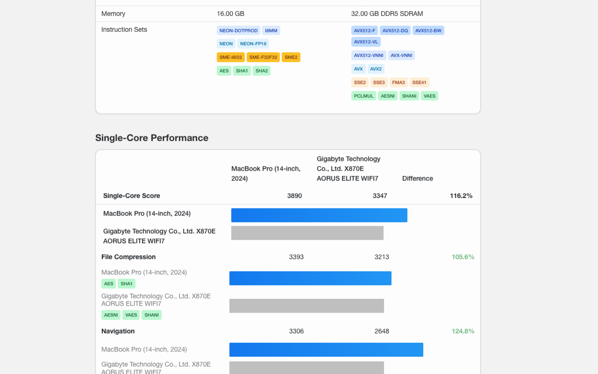

# GeekLens

A browser extension that enhances Geekbench CPU benchmark results formatting by annotating tests with instruction set architecture (ISA) information.



## Features

- 🔍 Automatically annotates Geekbench CPU result pages with instruction set information
- 🎨 Color-codes instruction sets by type (AVX, AVX-512, SSE, AES, SHA)
- 📊 Shows which instruction sets are utilized by each benchmark test
- ⚡ Works with Geekbench 6 CPU results

## Why GeekLens?

Geekbench is a powerful benchmarking tool, but it doesn't show which CPU instruction sets are being used in each test. GeekLens fills this gap by overlaying this  information directly on benchmark result pages, helping users understand which CPU features are being tested and why certain CPUs might perform better on specific tests.

## Installation

### Chrome
1. Install from the [Chrome Web Store](#) (coming soon)
2. Or install manually:
   - Download this repository
   - Go to `chrome://extensions/`
   - Enable "Developer mode"
   - Click "Load unpacked" and select the repository folder

### Firefox
1. Install from [Firefox Add-ons](#) (coming soon)
2. Or install manually:
   - Download this repository
   - Go to `about:debugging#/runtime/this-firefox`
   - Click "Load Temporary Add-on"
   - Select any file in the repository folder

## Usage

1. Install the extension
2. Visit any Geekbench 6 CPU result page (e.g., https://browser.geekbench.com/v6/cpu/11907485)
3. GeekLens will automatically enhance the page with instruction set annotations

## Data Sources

The instruction set data is currently based on the Geekbench 6 benchmark internals documentation which can be found here: https://www.geekbench.com/doc/geekbench6-benchmark-internals.pdf
If you have any good sources for instruction set data, particularly for RISC-V please submit a pull request!

## Development

### Prerequisites
- Basic understanding of JavaScript, HTML, and CSS
- Familiarity with browser extension development
- Currently only tested with [bun.sh](https://bun.sh/package-manager) for package manager

### Setup
1. Clone this repository
2. Install dependencies (bun is preferred but npm/pnpm should work too)
   ```
   bun install
   ```
3. Development mode:
   - `bun dev` or `npm run dev`
4. Build for production:
   - For Chrome:
     ```
     bun run build:chrome
     ```
   - For Firefox:
     ```
     bun run build:firefox
     ```
5. Create distribution zip files:
   - For Chrome:
     ```
     bun run release:chrome
     ```
   - For Firefox:
     ```
     bun run release:firefox
     ```
6. Load the extension:
   - Chrome:
      - Navigate to `chrome://extensions/`
      - Enable "Developer mode"
      - Click "Load unpacked" and select the `dist/chrome` directory
   - Firefox:
      - Navigate to `about:debugging#/runtime/this-firefox`
      - Click "Load Temporary Add-on"
      - Select `manifest.json` file in the `dist/firefox` directory


## Contributing

Contributions are welcome! Please feel free to submit a Pull Request.

## License

This project is licensed under the MIT License - see the [LICENSE](LICENSE) file for details.

## Links

- [Geekbench](https://www.geekbench.com/) for their excellent benchmarking tool

---

*GeekLens is not affiliated with Primate Labs Inc. or Geekbench. All trademarks are the property of their respective owners.*
