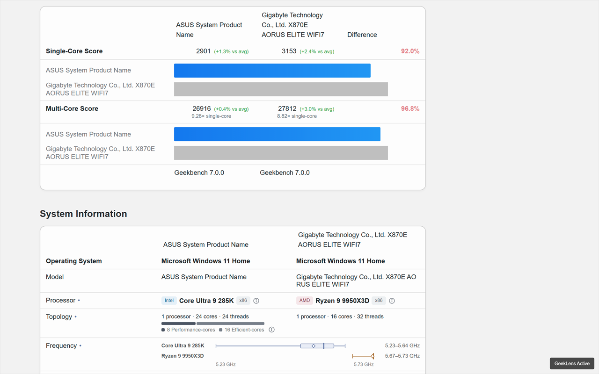
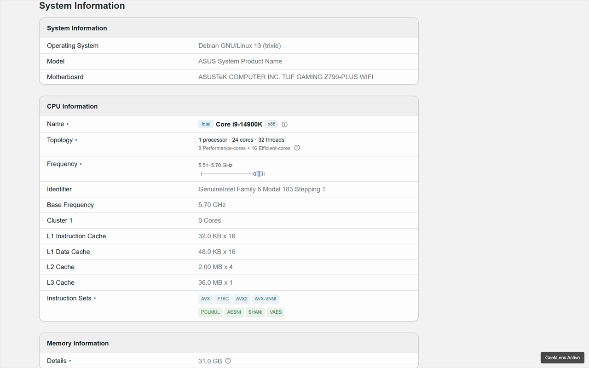
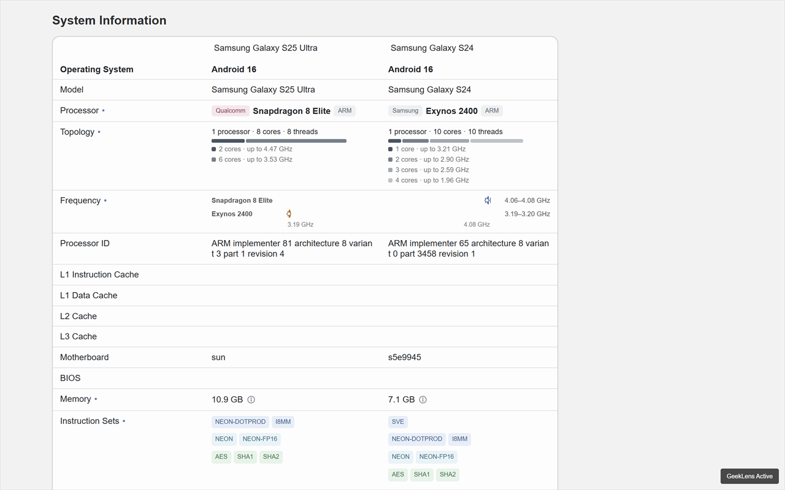
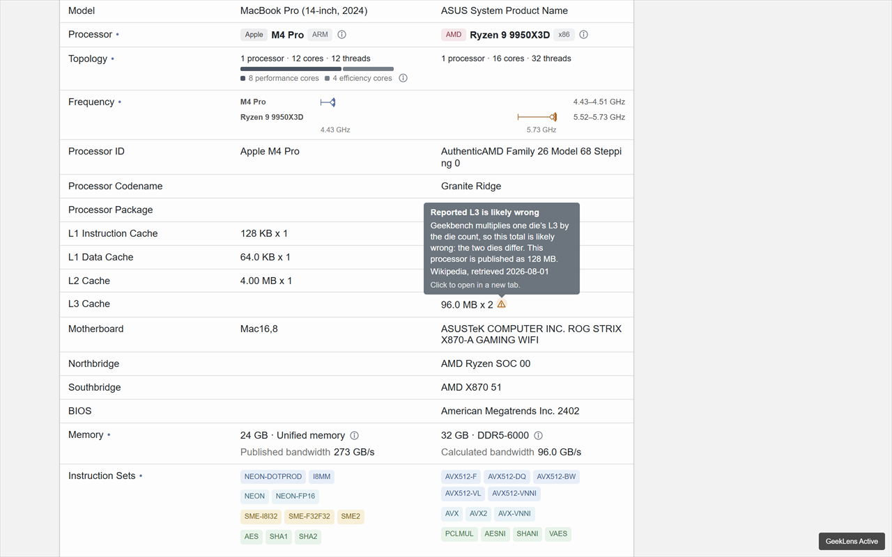
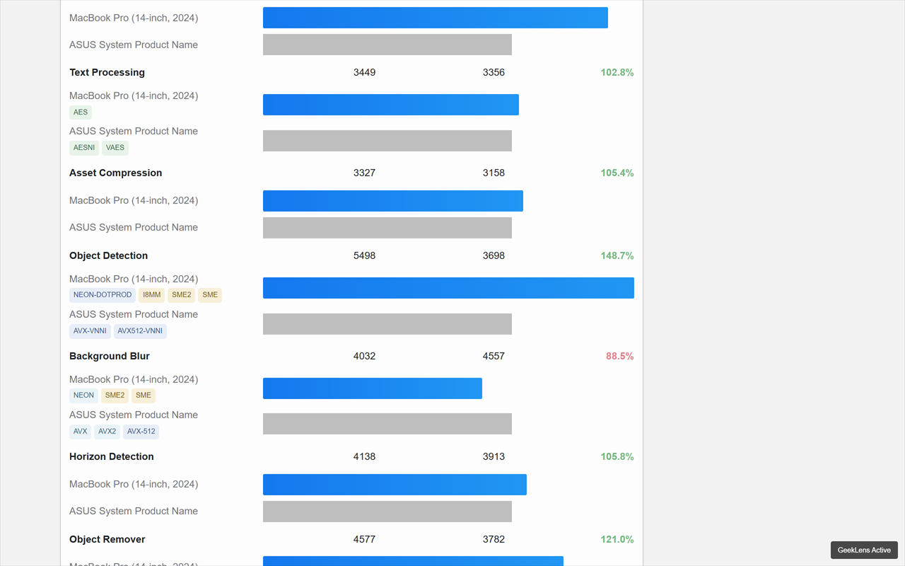

# GeekLens

A browser extension that adds processor context to Geekbench CPU results and comparisons. GeekLens presents processor identity, topology, frequency and memory details, score context, result validity and, where supported by available evidence, instruction-set annotations.



<details>
  <summary>More screenshots</summary>
  <br>
  <p align="center">
    <a href="screenshots/screenshot2.png"></a>
    <a href="screenshots/screenshot3.png"></a>
    <a href="screenshots/screenshot4.png"></a>
    <a href="screenshots/screenshot5.png"></a>
    <a href="screenshots/screenshot6.png"></a>
  </p>
</details>

## Features

- Supports Geekbench 5, 6 and 7 CPU result and comparison pages.
- Identifies the processor vendor and architecture, cleans up reported names and links exact matches to the Geekbench processor catalogue.
- Presents core, thread and cluster topology, including sourced core-type names when the reported layout can be matched unambiguously.
- Summarises the submitted run's frequency samples as a range and compact distribution.
- Adds memory capacity, configuration and bandwidth details from reported, computed or published data, with sources shown where applicable.
- Shows multi-core scaling and generation-matched Geekbench Browser average scores and deltas.
- Carries Geekbench result-validity information over to comparison pages and explains invalid results.
- Marks identified engineering samples and warns about known reporting problems, such as incorrect L3 totals on affected Ryzen X3D results.
- Adds system and per-workload instruction-set annotations when reliable capability and workload data are available. Unconfirmed mappings are labelled as such.
- Provides separate settings for each data group, badge colours, tooltips and mapping warnings.

## Scope and data quality

Geekbench results contain useful hardware and run metadata, but much of it is terse, split across views or absent from comparison pages. GeekLens presents that information in place without changing the benchmark scores.

Reported, computed and published facts are kept distinct. Published processor and system details come from a reviewed, bundled catalogue and include source links. Ambiguous hardware matches are left unresolved rather than guessed.

## Installation

### Chrome

1. Install from the [Chrome Web Store](https://chromewebstore.google.com/detail/geeklens/mkhncioijfcdjhaanpfodcaloniodabf)
2. Or install manually:
   - Download this repository
   - Go to `chrome://extensions/`
   - Enable "Developer mode"
   - Click "Load unpacked" and select the repository folder

### Edge

1. Install from [Microsoft Edge Add-ons](https://microsoftedge.microsoft.com/addons/detail/geeklens/llppfcakgcedojgfjfemijfekjnpekma)
2. Or install manually:
   - Download this repository
   - Go to `edge://extensions/`
   - Enable "Developer mode"
   - Click "Load unpacked" and select the `dist/chrome` directory

### Firefox

1. Install from [Firefox Add-ons](https://addons.mozilla.org/en-US/firefox/addon/geeklens/)
2. Or install manually:
   - Download this repository
   - Go to `about:debugging#/runtime/this-firefox`
   - Click "Load Temporary Add-on"
   - Select any file in the repository folder

## Usage

1. Install the extension
2. Visit a supported CPU result page (for example, https://browser.geekbench.com/v7/cpu/1248)
3. GeekLens adds the available processor and result context to the page

Geekbench 7 instruction data is only available while signed in to Geekbench,
including on single-result pages.

Geekbench 5 exposes no instruction-set capability data in the captured result pages or payloads. Processor context remains available, but ISA workload annotations do not.

## Data Sources

- Processor and system context is derived from Geekbench result metadata and a bundled catalogue of reviewed hardware facts. Published values retain their source links.
- Geekbench 6 workload mappings are based on the [Geekbench 6 benchmark internals documentation](https://www.geekbench.com/doc/geekbench6-benchmark-internals.pdf).
- Geekbench 7 system instruction sets are read from the result payload. Per-workload mappings remain deliberately limited and carry an amber warning until equivalent benchmark-internals documentation or direct instruction traces are available.
- [Geekbench 7 data sources and confidence](docs/geekbench7-sources.md) records the mapping provenance, open questions and evidence requirements.
- [Processor catalogue sources](docs/processor-catalogue-sources.md) records the source hierarchy and maintenance policy for published hardware data.

## Development

### Prerequisites

- [Bun](https://bun.sh/) 1.3.14 or newer
- [Node.js](https://nodejs.org/) 24.18 or newer
- A modern web browser (currently Chrome or Firefox have been tested)

### Setup

1. Clone this repository
2. Install dependencies:
   ```
   bun install
   ```
3. Development mode:
   - `bun dev`
4. Build for production:
   - For Chrome:
     ```
     bun run build:chrome
     ```
   - For Firefox:
     ```
     bun run build:firefox
     ```
5. Run tests:
   ```
   bun test
   ```
   Other quality checks:
   ```
   bun run lint
   bun run format:check
   bun run check
   ```
6. Create distribution zip files:
   - For Chrome:
     ```
     bun run release:chrome
     ```
   - For Firefox:
     ```
     bun run release:firefox
     ```
7. Load the extension:
   - Chrome:
     - Navigate to `chrome://extensions/`
     - Enable "Developer mode"
     - Click "Load unpacked" and select the `dist/chrome` directory
   - Firefox:
     - Navigate to `about:debugging#/runtime/this-firefox`
     - Click "Load Temporary Add-on"
     - Select `manifest.json` file in the `dist/firefox` directory

### Technical Details

- This project uses [vite-plugin-web-extension](https://github.com/samrum/vite-plugin-web-extension) for building browser extensions with Vite
- Both builds use Manifest V3. Chromium runs the background as a service worker;
  Firefox runs it as an event page, since Firefox does not support
  `background.service_worker`

## Contributing

Open an issue before making a substantial behavioural or data-model change. Corrections to processor data should include a suitable source; see the catalogue source policy above.

## License

This project is licensed under the MIT License - see the [LICENSE](LICENSE) file for details.

## Links

- [Geekbench](https://www.geekbench.com/)

GeekLens is not affiliated with Primate Labs Inc. or Geekbench. All trademarks belong to their respective owners.
