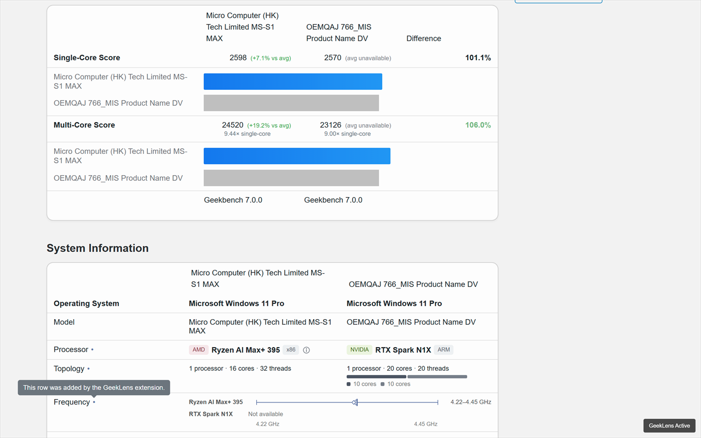

# GeekLens

A browser extension that enhances Geekbench CPU benchmark results formatting by annotating tests with instruction set architecture (ISA) information.



## Features

- 🔍 Automatically annotates Geekbench CPU result pages with instruction set information
- 🎨 Color-codes instruction sets by type (AVX, AVX-512, SSE, AES, SHA)
- 📊 Shows which instruction sets are utilized by each benchmark test
- ⚡ Adds processor context to Geekbench 5, 6, and 7 CPU results

## Why GeekLens?

Geekbench is a powerful benchmarking tool, but it doesn't show which CPU instruction sets are being used in each test. GeekLens fills this gap by overlaying this information directly on benchmark result pages, helping users understand which CPU features are being tested and why certain CPUs might perform better on specific tests.

## Installation

### Chrome

1. Install from the [Chrome Web Store](https://chromewebstore.google.com/detail/geeklens/mkhncioijfcdjhaanpfodcaloniodabf)
2. Or install manually:
   - Download this repository
   - Go to `chrome://extensions/`
   - Enable "Developer mode"
   - Click "Load unpacked" and select the repository folder

### Edge

1. Install from [Microsoft Edge Add-ons](https://microsoftedge.microsoft.com/addons/detail/geeklens/llppfcakgcedojgfjfemijfekjnpekma)
2. Or install manually:
   - Download this repository
   - Go to `edge://extensions/`
   - Enable "Developer mode"
   - Click "Load unpacked" and select the `dist/chrome` directory

### Firefox

1. Install from [Firefox Add-ons](https://addons.mozilla.org/en-US/firefox/addon/geeklens/)
2. Or install manually:
   - Download this repository
   - Go to `about:debugging#/runtime/this-firefox`
   - Click "Load Temporary Add-on"
   - Select any file in the repository folder

## Usage

1. Install the extension
2. Visit a supported CPU result page (for example, https://browser.geekbench.com/v7/cpu/1248)
3. GeekLens will automatically enhance the page

Geekbench 7 instruction data is only available while signed in to Geekbench,
including on single-result pages.

Geekbench 5 exposes no instruction-set capability data in the captured result
pages or payloads, so GeekLens provides processor context there without ISA
workload annotations.

## Data Sources

- Geekbench 6 workload mappings are based on the [Geekbench 6 benchmark internals documentation](https://www.geekbench.com/doc/geekbench6-benchmark-internals.pdf).
- Geekbench 7 system instruction sets are read from the result payload.
  Per-test instruction information is currently extremely limited and marked
  with an amber warning until Primate Labs publishes
  `geekbench7-benchmark-internals.pdf`.
- See [Geekbench 7 data sources and confidence](docs/geekbench7-sources.md) for mapping provenance, known unknowns, and research requirements.
- If you have any good sources for instruction set data, **particularly for RISC-V** please submit a pull request!

## Development

### Prerequisites

- [Bun](https://bun.sh/) 1.3.14 or newer
- [Node.js](https://nodejs.org/) 24.18 or newer
- A modern web browser (currently Chrome or Firefox have been tested)

### Setup

1. Clone this repository
2. Install dependencies:
   ```
   bun install
   ```
3. Development mode:
   - `bun dev`
4. Build for production:
   - For Chrome:
     ```
     bun run build:chrome
     ```
   - For Firefox:
     ```
     bun run build:firefox
     ```
5. Run tests:
   ```
   bun test
   ```
   Other quality checks:
   ```
   bun run lint
   bun run format:check
   bun run check
   ```
6. Create distribution zip files:
   - For Chrome:
     ```
     bun run release:chrome
     ```
   - For Firefox:
     ```
     bun run release:firefox
     ```
7. Load the extension:
   - Chrome:
     - Navigate to `chrome://extensions/`
     - Enable "Developer mode"
     - Click "Load unpacked" and select the `dist/chrome` directory
   - Firefox:
     - Navigate to `about:debugging#/runtime/this-firefox`
     - Click "Load Temporary Add-on"
     - Select `manifest.json` file in the `dist/firefox` directory

### Technical Details

- This project uses [vite-plugin-web-extension](https://github.com/samrum/vite-plugin-web-extension) for building browser extensions with Vite
- Both builds use Manifest V3. Chromium runs the background as a service worker;
  Firefox runs it as an event page, since Firefox does not support
  `background.service_worker`

## Contributing

Contributions are welcome! Please feel free to submit a Pull Request.

## License

This project is licensed under the MIT License - see the [LICENSE](LICENSE) file for details.

## Links

- [Geekbench](https://www.geekbench.com/) for their excellent benchmarking tool

---

_GeekLens is not affiliated with Primate Labs Inc. or Geekbench. All trademarks are the property of their respective owners._
